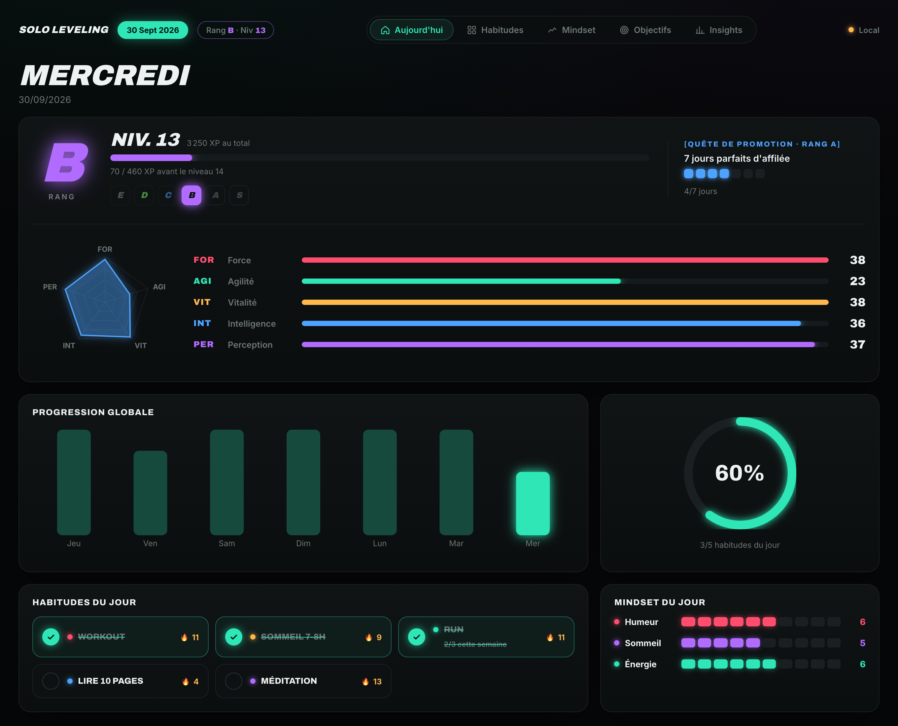
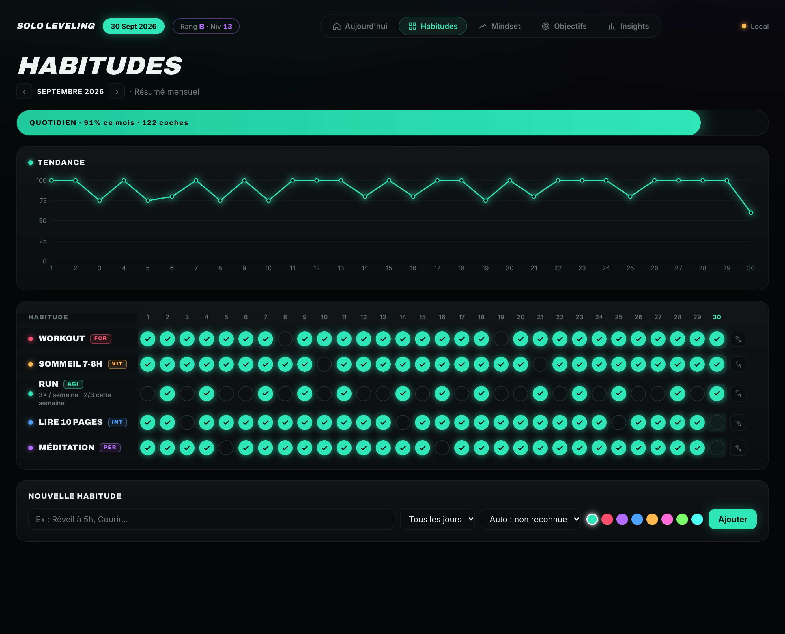
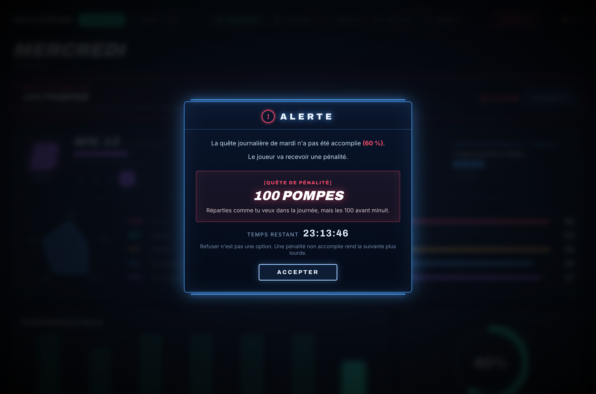

# Solo Leveling — Habit Tracker

Un tracker d'habitudes au style néon, inspiré de *Solo Leveling* : si tu rates ta journée, le **Système** t'inflige une pénalité. Tu montes en niveau, tu passes des quêtes de promotion de **E** à **S**, et tes habitudes nourrissent tes stats de chasseur.



## Fonctionnalités

- **Habitudes** : grille du mois, séries 🔥, fréquence « tous les jours » ou « X fois par semaine ».
- **Pénalités du Système** : si la veille n'est pas à 100 %, une punition est tirée au sort dans une banque de 30 (100 pompes, douche froide, zéro réseaux…). Pas de refus possible, et une pénalité ratée rend la suivante plus lourde.
- **Niveau & XP** : chaque journée rapporte des XP selon ton % de réussite.
- **Rangs E → S** : calculés sur ta moyenne des 30 derniers jours. Pour monter, il faut réussir une quête de promotion. Le rang S demande 14 jours parfaits d'affilée.
- **Stats du joueur** (Force, Agilité, Vitalité, Intelligence, Perception) : chaque habitude est classée automatiquement d'après son nom, et chaque coche fait monter sa stat.
- **Mindset** (humeur, sommeil, énergie), **objectifs** avec étapes, **insights**.
- Données dans le navigateur, ou synchronisées sur **Supabase** avec login (un seul compte : le tien).

| Habitudes | Pénalité |
|---|---|
|  |  |

## Installation avec une IA

Donne ce message à ton assistant de code (Claude Code, Cursor, Codex…) :

> Installe-moi ce projet : https://github.com/Myamotto/solo-leveling-habit-tracker — suis les instructions de AGENTS.md.

L'IA te posera les quelques questions nécessaires (mode local ou Supabase, ton email…) et fera le reste.

## Installation manuelle

Il faut [Node.js](https://nodejs.org) 20 ou plus.

```bash
git clone https://github.com/Myamotto/solo-leveling-habit-tracker.git
cd solo-leveling-habit-tracker
npm install
npm run dev
```

Ouvre http://localhost:5173. Sans configuration, l'app fonctionne en **mode local** (pastille « Local ») : les données restent dans ton navigateur, sans login.

### Synchroniser avec Supabase (optionnel)

Pour retrouver tes données sur tous tes appareils :

1. Crée un projet gratuit sur [supabase.com](https://supabase.com).
2. Ouvre `supabase/schema.sql`, remplace `TON_EMAIL@exemple.com` par ton email, puis colle tout le fichier dans **SQL Editor → Run**.
3. Copie `.env.example` en `.env` et remplis-le avec l'URL du projet et la clé *anon / publishable* (Project Settings → API).
4. Relance `npm run dev`, clique sur « Créer le compte » avec le même email, et confirme-le via le lien reçu.

Seul ce compte peut lire et écrire les données : les règles de sécurité (RLS) bloquent tous les autres.

### Mettre en ligne (optionnel)

Le projet se déploie tel quel sur [Vercel](https://vercel.com) (offre gratuite) : importe le repo, ajoute les variables `VITE_SUPABASE_URL` et `VITE_SUPABASE_ANON_KEY`, puis déploie. Pense à ajouter l'adresse du site dans Supabase → Authentication → URL Configuration.

## Personnaliser

| Quoi | Où |
|---|---|
| Banque de pénalités | `src/lib/penalties.js` |
| Rangs, quêtes de promotion, XP | `src/lib/ranking.js` |
| Stats et mots-clés de détection | `src/lib/attributes.js` |
| Critères du mindset | `src/lib/store.jsx` (`MINDSET`) |
| Couleurs et style | `src/index.css` |

## Stack

React 19, Vite, Recharts, Supabase (optionnel). Aucun autre service.

## Licence

[MIT](LICENSE). Projet de fan, sans lien avec les ayants droit de *Solo Leveling*.
